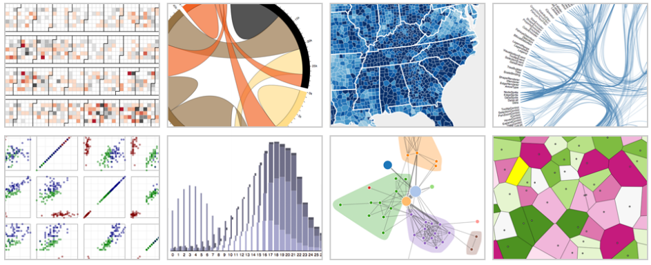

# D3：数据驱动文档（1）

**图1 使用 D3 创建的交互可视化图，运行在 Google Chrome 中。从左到右依次是：日历图，弦图，等值线地图，分层边缘捆绑图，散点矩阵图，分组和堆叠柱状图，力导向集群图，泰森多边形镶嵌图。**

**摘要**：数据驱动文档（D3）是一种新颖的表现层透明的 web 可视化方法。D3 允许对原生的表现层即标准对象模型（DOM）进行直接的查看和操作，而不是利用特定的工具抽象集将底层视图隐藏。设计者可以使用 D3 选择性地将输入数据绑定到特定的文档元素上，并应用动态变换生成和修改内容。本文说明了 D3 的表现层透明相比于以前的方法是如何提高表现力和提供更好的集成的，并且提供了具有比较性的效率值和保留的强大的声明式模块。D3 运算符的快速计算还进一步简化了调试，并允许协同开发。此外，本文证明了 D3 的自然转换使得动画和交互相比于中间表现层有了很大的性能提升。

**关键词**：信息可视化，用户界面，工具包，2D 图形。

## 1.介绍

设计者在创建可视化时通常需要同时借助多项工具，在对 Web 进行可视化时尤其如此，因为网页的交互可视化涉及多种技术：HTML 实现网页内容，CSS 实现网页样式，JavaScript 实现网页交互，SVG 实现网页矢量图，等等。将 Web 作为平台的一个成功就在于这些技术的完美结合，而促使这些技术得以结合的是共享的页面表现层，文档对象模型（DOM）。DOM 暴露了段落、表格等页面内容的层次结构，使得可以对元素进行引用和操作。现代浏览器除了提供程序接口外，还拥有强大的图形工具，使得开发者可以呈现元素树，获取继承样式值，调试交互脚本等。

不幸的是，这些美好的互操作性会因为使用可视化工具包而消失，因为这些工具包【2，9，18】将 DOM 以更特殊的形式进行了封装，以定制的视图抽象取代了对现有模型的操作。这种方法省去了指定可视化的工作，因而可能得到实质的性能提升，但它带来了很高的机会成本，因为它忽略了开发人员关于标准的知识，而这些工具和资源又增加了标准。

由此产生的学习表现层的困难可能会比其带来的好处还要大，至少对于新用户来说是这样。文档的缺乏和低效的调试还会进一步加剧这个困难，阻碍用户更深入地理解工具包的抽象，进而限制工具包的潜力。有着中间视图抽象和延迟属性计算的系统将很难调试，因为内部结构只会在出错的情况下暴露出来，往往也不是期望的时机。

此外，中间视图可能会降低表现力，进而影响到给用户的印象，还会引入持续的运行时开销。封装还会导致某些可以给到别的工具的任务无法分配出去，比如指定字体本应该通过 CSS 来完成。同样的，虽然底层的视图可能会支持如裁剪等图形处理功能，但这些方法并不会被暴露出来。即使为了更好的可视化而支持对工具包进行扩展，但这需要开发者对其内部原理有着很深入的了解，而这势必会对普通用户产生障碍。
        
除了在尝试平衡表现力，效率，可访问性时意识到的问题外，以上问题的感知还部分来源于在 Protovis【2】发布后的两年内对成千上万的用户进行观察得到的结果。现在我们来完善以下三个目标：

**兼容性**：工具不是独立存在的，而是共处于一个组件生态圈内的。技术重用利用先验知识和参考资料，可以提高其可访问性。卸载特定工具的任务子集可以提高效率，并避免单一方法的普遍性和复杂性。对原生视图的操控去除了表现力上的限制。

**调试**：尝试和出错是开发和学习过程中的一部分。可用性工具必须设计成可调试的，而更好的工具可以促进用户去探索交互操作的负面影响。虽然对控制流和视图的封装往往可以提高效率，但它也有可能会导致内部状态暴露时出现的“阻抗不匹配”，进而破坏用户的心智模型。
       
**性能**：交互和动画【15】可以增强可视化。但高层次的抽象可能会存在限制，比如开发者在系统缺乏足够的信息（如依赖图）时执行快速增量式场景变化以避免冗余计算，这种能力有可能会受到限制。专注在转换上而不是视图上会将这份责任转移到开发人员，从而可以提高性能，并且允许动画和交互。

为了解决这些问题，我们开发了数据驱动文档（D3），一种嵌入式的特定领域的语言【16】，它可以依据数据来变换文档。设计者可以使用 D3 选择性地将输入数据绑定到任意的文档元素上，应用动态变化来生成和修改内容，文档即是视图。（这是 Protovis 的一个概括，通过在变换之上构建的声明式辅助模块，我们能够利用具有比较性的效率值来实现规范）。此外，D3 的标准化表示提高了表现力和可用性,而转换获得了引人注目的性能收益和动画过渡。
         
本文通过比较 D3 和现有的基于 Web 的可视化方法，思考语言设计如何实现上述目标。本文还描述了几个应用程序来表明代表性的应用。通过性能评测，本文还证明了 D3 比 Protovis 至少快两倍。最后，本文分享了几个故事，以表明 D3 在动态可视化上的潜力。