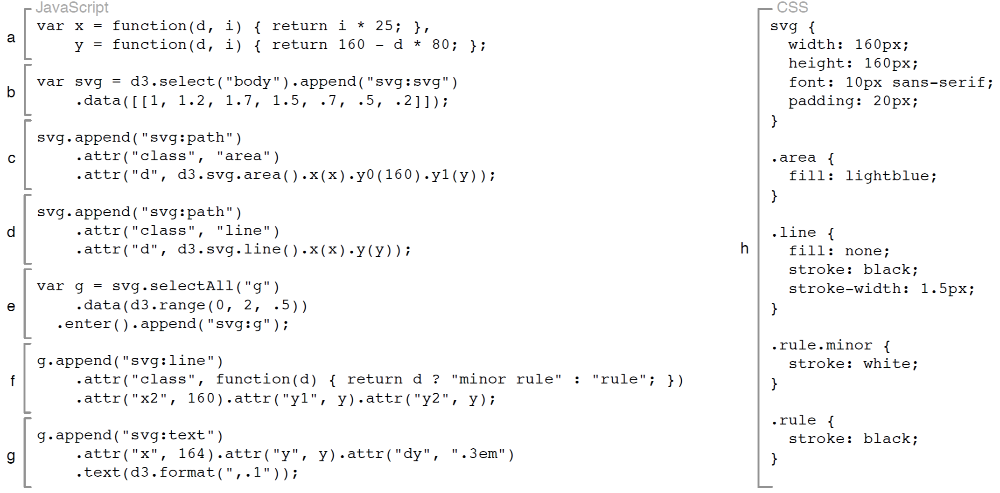
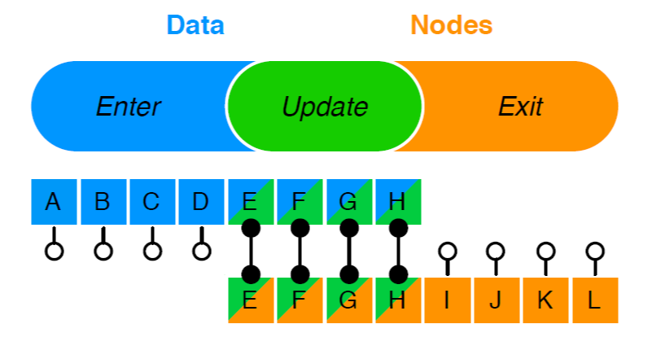
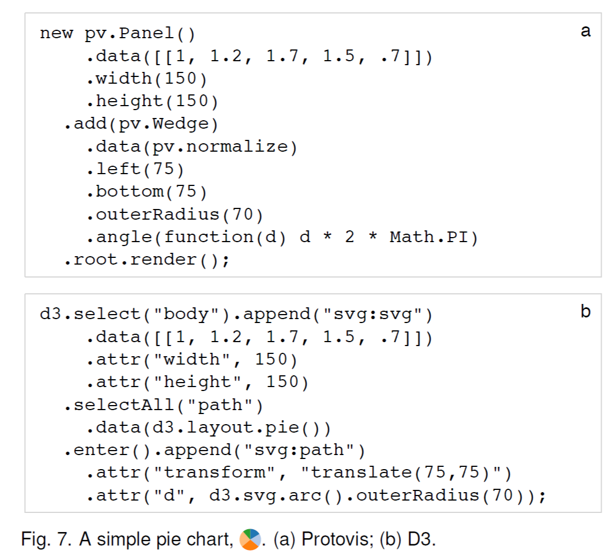

# D3：数据驱动文档（3）

## 3.设计

D3 的原子运算符是选择器，用以从当前文档中查询元素。运算符作用在选集之上，对内容进行修改。数据连接将输入数据绑定到元素上，使得依赖数据的功能运算符可以发挥作用，在数据变化导致元素创建和销毁时会产生 enter 和 exit 子集。虽然运算符的作用默认是瞬时的，但动画过渡会随时间变化平滑地插入属性和样式。调用事件处理函数的特殊运算符对用户输入进行响应，允许交互。大量的辅助模块，如布局和缩放等，可以简化常见的可视化任务。

### 3.1 选集

D3 采用 W3C 的选择器 API 获取选集对应的文档元素，它包含许多谓词，可以通过标签(“tag”)，类 (“.class”)，唯一标示符（“#id”），属性（“[name=value]”），容器（“parent child”），邻接（“before ∼ after”）等筛选元素。谓词可以被分割（“.a.b”）也可以被结合（“.a, .b”），从而得到丰富且精确的选择器方法。

d3 是一个全局变量 ，也可作为一个命名空间，它提供 select 和 selectAll 方法获取选集。它们接收选择器语言，select  只返回符合谓词的选集的第一个元素，selectAll 以文档的遍历顺序返回所有匹配的元素。这些方法也可以直接接收 node 节点引用，适用于通过外部方法，比如第三方库或者开发工具获取的 node 节点。

选择元素上可以应用任意数量的运算符。这些运算符涵盖了 W3C DOM API，包括设置特性（attr）、样式（style）、属性（property）、HTML（html）、文本（text）内容等。运算符的值被指定为常量或者函数，其中函数会被应用到每个元素上。内置的运算符已经满足了大部分的需求，为了普遍性，每个运算符会调用任意的一个 JavaScript 回调。因为每一个选集只是一个简单的数组，所以其中的每个元素都可以被获取到（e.g., [0]）。

D3 支持链式调用，当应用多个运算符时，这种方式更加简洁，其中，运算符的返回值是选集。（例如，图7中的饼图的实现只用了一行声明。）append 和 insert 运算符
为当前的选集中的每一个元素新增一个元素，并返回新增的节点，因此嵌套结构的创建是很方便的。remove  运算符删除选中的元素。

虽然顶层的 select 方法会对整个文档进行查询，但选集之上的 select 和 selectAll 运算符会将查询范围限制到每个选中元素的子节点中，我们称作子选集。例如，d3.selectAll("p").select("b") 返回每一个段落（“p”）元素中的第一个加粗（“b”）元素。

```
// a
var ps = document.getElementsByTagName("p");                         

for (var i = 0; i < ps.length; i++) {  
   var p = ps.item(i);
   p.style.setProperty("color", "white", null);
}

// b
p { color: white; } 

// c
$("p").css("color", "white"); 

// d
d3.selectAll("p").style("color", "white");  
```
**图3.简单的文档转换：将段落颜色变为白色。(a) W3C DOM API (b) CSS (c) jQuery (d) D3**



**图5. 图4的区域图说明。(a) 定义位置编码的缩放函数。(b) 在文档中添加一个 SVG 容器并绑定数据。(c) 为该区域图添加一个 path 元素。(d) 添加一个 path 元素，突出上面的线。(e) 给参考值添加容器。(f) 添加参考线。(g) 添加参考标识。(h) 用 CSS 指定颜色和其它样式。**

通过 selectAll 运算的子选择得到的元素集合将用祖先进行分组。因此， d3.selectAll("p").selectAll("b") 的选集用段落进行分组，d3.selectAll("p b") 则会返回一个扁平的选集。通过 select 进行的子选择是相似的，但会保留分组和传播数据。分组在数据连接方面扮演了重要的角色（见§3.2），功能性运算符可能需要依赖当前元素在其分组中的索引（如图5中的x刻度）。

### 3.2 数据

data 运算符将输入数据绑定到选取的节点上。D3 使用格式无关的处理[13]：数据是一个数组，里面的元素可以是任意类型的值，数字、字符串或者对象。一旦数据被绑定到元素上，它将被作为第一个参数传入到功能运算符中（按照惯例，参数名为 d），跟随该参数一起的还有数字索引（i）。这些参数的选择是为了保持和 JavaScript 内置数组方法的一致，但与 Protovis 为任何封闭面板数据都提供额外参数的做法是偏离的。上述方法简化了 D3 的选集结构（只需要一层分组），并避免了变量参数。


**图6. 当新数据（蓝色）被绑定到旧的节点（橙色），会产生三种子集：*enter*，*update*，*exit*。**

默认而言，数据和元素之间按照索引关系绑定：第一个元素绑定第一个数据，以此下去。为了精确地控制数据与元素的对应关系，可以向 data 运算符中传递一个 key 函数[13]。匹配的 key 值在转变过程中会保持对象不变。在计算数据绑定后，如果还有数据或者元素剩余，那它们将会被分别分配到 enter 和 exit 子集中。enter 中的数据没有对应的节点，exit 中的节点没有对应的数据。例如，如果数据被绑定到一个空选集上，enter 运算符将为每一个传入的数据返回一个占位符节点，这些节点可以通过 append 或者 insert 被实例化。同样的，如果新数据被绑定到一个已经存在的选集上，exit 运算符将返回每一个传入的数据的绑定元素，允许其被删除。以关系代数的说法，给定数据 D 和节点 N，enter  集合是 D ◃ N（左边），exit 集合是 N ◃ D（右边），update 集合是 D ◃▹ N (中间)。待更新节点通过 data  运算符返回，一般情况下，enter 和 exit 集合都是空的，所以会很方便。

**enter, update 和 exit 的描述允许精确控制元素的生命周期**。在元素生命周期中都不会变得属性在 enter 中被设置一次，而动态属性则会在每次更新时被计算一次。动画过渡(见§3.3)在三种状态中都可以被定义。**更普遍的是，数据连接使得数据和元素有着精确的对应关系，虽然这对静态可视化而言是不必要的，但它对高效的动态可视化的却很关键**。

数据具有“粘性”，一旦被绑定到节点上之后，后续的再选取的集合也会和数据相绑定，无须再次使用 data 运算。这简化了后续的变换,以及关键功能的实现:新的数据可以直接与旧的数据进行比较,而不需要在文档中对数据的键值进行序列化。数据也可以用来重新排序(sort)或剔除元素(filter)。

### 3.3 交互和动画

文档对象模型支持事件监听器：接收用户针对特定元素输入事件的回调函数。D3 的 on 运算符暴露了该功能，提供原生事件类型。为了与其他功能运算符保持一致，回调函数接收数据和索引作为参数(d,i),允许数据驱动交互。目标节点是 this，当前的事件是 d3.event。通过名称空间，多个监听器可以在元素上共存(如，“click.foo”)。
 
D3 专注在转换上，这简化了响应用户事件的场景变化的规范。语义和初始化时一样。此外，动画过渡可以通过在选集上使用 transition 运算符实现。Transitions 对象以相同的语法输出选集的 style 和 attr 运算符，但会随着时间的推移从当前逐渐插入到指定值。为了单个元素交错的动画，我们可以通过 transitions 的 delay 和 duration 等功能运算符来指定。过渡也可以定制，标准过渡函数[17，26]，如“elastic”、“cubic-in-out”和“linear”等可以通过名字指定。

驱动 D3 转换的是支持不同类型的插入器集合：数字、字符串和嵌入式数字(如，字体大小、路径数据);RGB 和 HSL 颜色;任意嵌套的数组或对象。如果需要，还可以指定自定义插入器。饼图中的动画值变化就是这样一个定制的例子，在极坐标插入受约束的弧数据，而不是在笛卡尔坐标中插入路径字符串。
 
元素在结束动画时，Transitions 会分发事件，注册监听器，从而可以实现连续转换和动画后的清理，如删除 exit 集合中的元素。由于不确定性，元素可能会在不同的时间完成动画。D3自动管理过渡调度,保证每个元素的排他性和高效性，并通过一个统一的定时器队列保持一致的时间。这种优化设计很容易扩展到成千上万的并发计时器中。

### 3.4 模块

如前面所述，通过表现层透明，D3的内核达到了灵活性，这也减少了概念上的学习成本。但是，想要减少常见任务的负担，我们还需要更多。尽管我们一直在努力实现定制的可视化设计，但我们也得承认塔夫特原则[36]：“不用让它很新颖，要让它正确。”D3 的可选模块封装了常见问题的可重用解决方法，提高了效率，并证明了高阶编程通过函数运算符达到的效果。



作为一个替代专业 Protovis 的图形原语，d3.svg 模块提供了适合图表的各种形状。例如，arc 函数用来创建饼图和甜甜圈图中的椭圆弧线，通过将任意数据映射到路径上。通常，这个函数会和SVG路径元素的“d”属性绑定(如图7)。注意，弧的半径和角度可以被指定为常数或函数，在后者的情况下，函数会访问数据，给每个元素计算返回值，这与 D3 的核心运算符相同。因此，辅助图形在没有实现新的语义和封装底层形式的情况下提供了特定的表现。此外，类似的，还有额外的形状、如区域、线条、散点图符号等等。

D3 的标尺增强了它的插入器，简化了视觉编码。这些标尺与 Protovis 的相似，支持序数和定量(线性、对数、指数、分位数)值。D3 里面也打包了 Cynthia Brewer 的有用的颜色标尺[10]。

D3 的布局通过生成抽象数据结构，提供了可重用的、灵活的可视化技术。例如,分区布局会计算一个二维空间层次的细分，每个节点有一个封闭的 x 和 y 的范围。节点被绑定到旭日图[32]的弧(x→θ,y→r)或冰柱树的矩形上。和弦布局利用加权邻接矩阵计算出角度划分，得到径向图风格的圆环[20]。力布局结合物理模拟和迭代约束松弛[7]实现稳定的图布局。堆栈布局为堆叠图计算出 y0 基线[11,4],而正方化树图布局[31,3]计算出适合动画另一个空间分区(见§5.1)。更多的布局还在发展当中。

交互技术通过行为重用实现。缩放行为通过监听鼠标事件实现平移和缩放。在平移或缩放中，一个定制的事件会被分发，通知一个二维的移动或缩放。这个事件可以用于几何或语义缩放[27]。
 
函数运算符有着惊人的深度。例如，geo 模块暴露的 path 运算符可以将地理数据映射到像素坐标中。 投影是可配置的，如阿尔伯斯图(对于等值线图和变形区，对区域的保护是必需的),或覆盖基于网络的瓦片地图的墨卡托图。path 运算符支持 GeoJSON 格式[34]，包括与断开区域和洞的边界，以及质心和边界框的计算。geom 模块暴露了各种地理运算符，包括泰森多边形法镶嵌,游行广场,凸壳,多边形剪裁和四叉树等。

D3 还包含了各式各样的数据处理工具，如嵌套和交叉操作符，CSV 解析器,日期和数字格式等。这些对可视化都是非常有用的，但足够明显的是，在未来我们可以将它们分开打包。未来的工作还需要在这一领域进行，类似 R [35]中的丰富的统计方法集合将尤其有价值。
