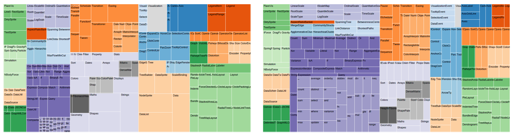
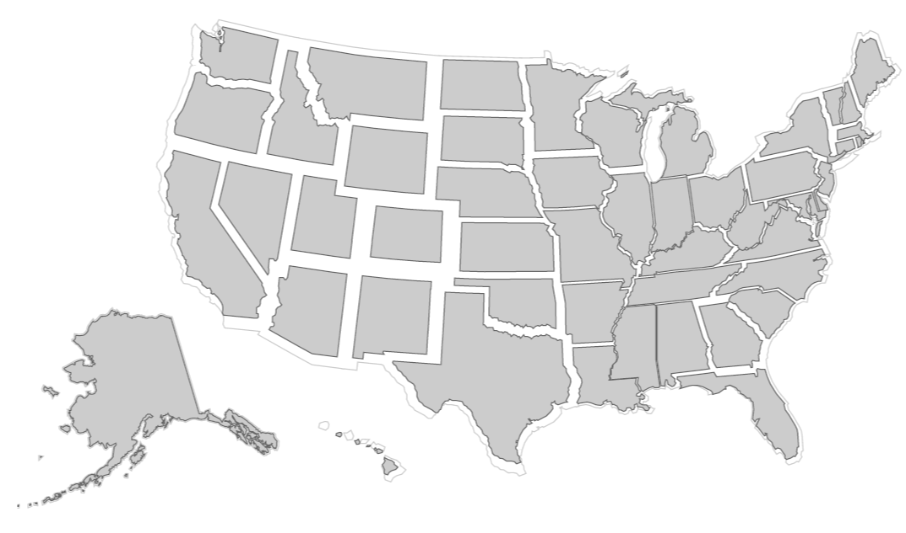
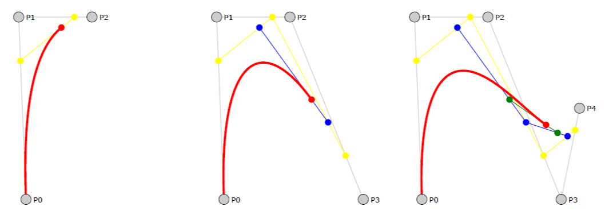

# D3：数据驱动文档（5）

## 5 示例应用

在开发课程中，我们已经使用 D3 创建了许多可视化，包括真实应用，框架兼容测试以及提供给新用户的教学示例。现在，我们介绍几个示例应用，以传达 D3 的典型应用和独特功能。为了简洁，完整的源代码不会被展示出来，网上可以看到[6]。

### 5.1 动画 HTML 树图

我们使用 treemap  布局，在 Flare[9] 中创建了一个方形树图类。每一个节点映射到一个方形的 HTML div 元素。尽管 HTML 的表现力不如 SVG，但它兼容低版本的浏览器，并且可以展现出框架的灵活性。布局计算出 x, y, ∆x 和 ∆y 的值，并将其映射成位置样式。例如，“left”的 style 运算符被定义为 function(d) { return d.x+"px"; } ， d3.scale.category20 设置节点的背景色，text 运算符生成标记。

**图2. D3 绘制的树图。使用纯 HTML & CSS 实现，提高了浏览器兼容性。稳定的布局算法启用动画转换来改变单元格的值（从左到右），不会引起重排混乱。**

两个区域编码通过布局中的 value 运算符被指定，文件大小（d.value）和文件数量（1）。因此，在后一个例子中，每一个叶子节点拥有相同的大小。绑定了点击事件处理函数的按钮可以对两种编码进行切换，初始动画过渡效果。树图布局的配置具有“粘性”，使得在更新过程中，节点在水平和垂直方向的分配得以保持。这使得节点可以被平滑地调整大小，而不会出现阻碍获取变化值得混编或者阻塞。虽然对于一种或者两种状态的布局而言，这个结果并不是最满意的，但也是可以接受的（见图 2）。如果需要，我们可以将此布局扩展到平衡多种状态（在布局之前平均化值），或者一串连续的动画可以调整大小并适应。

静态的树图通过21行 JavaScript 得以实现，相对于 Protovis 17行的实现，该增长微不足道。加入交互和动画后，代码会增长到54行。

**图8. D3 绘制的肥胖率（BMI >=30）统计图。肥胖率范围是10.0%（科罗拉多州）到20.1%（印第安纳州）。**

### 5.2 非连续统计图

D3 的 geo 模块简化了地理可视化。为了证明这一点，我们创建了一个非连续统计图[25]，通过对每个区域在其预计的中心点进行扩展，将地区值编码成为了区域。一个非连续的亚尔勃斯投影展示了48个州，夏威夷和阿拉斯加通过美国地质勘探局推荐。州的边界数据以 GeoJSON  的形式被异步加载，然后通过 geo.path 运算符被映射为 SVG 元素。 州边界数据提前从美国人口调查局下载，通过 MapShaper 简化，然后通过 GDAL  转换成 GeoJSON  。

生成了三份视图进行叠加。第一份在背景处，用粗的灰色边界线呈现出光圈效果。第二份在中间，用白色填充遮挡中间的笔画。最后一份在最前面，用来编码数据。国家轮廓的灰色光圈效果可以帮助查看视图的人识别区域的变形。

利用 SVG 的 “transform” 属性将州围绕它们的中心点进行扩展。为了围绕一个位置而不是一个区域进行扩展，许多的变换操作被串联起来，即“translate(x, y) scale(k) translate(−x, −y) ”。x、y 的值通过 path 运算符的 centroid 方法计算，k 与输入值的平方根成正比，输入值是疾病预防控制中心在2008年报道的肥胖率。为了减少相邻州的重叠， k ≤ 1。

这个例子的实现需要34行 JavaScript 代码，不包含数据和注释。线的宽度和颜色通过 CSS 指定。

### 5.3 贝塞尔曲线解释

D3 并不局限于标准的数据可视化，通过将任意数据映射到 DOM 元素，它可以实现很多种数据驱动的图形。D3 的贡献者  Jason Davies 实现了一个有趣的例子，他设计了一个关于创建参量的贝塞尔曲线的教程。该教程具有交互和动画，当参数 t 从0变化到1时，控制点会移动，从而影响曲线。中间插值步骤展现为彩色的跨度范围（黄色表示二次的，蓝色表示三次的，绿色表示四次的）。

**图9. 贝塞尔曲线的可视化解释。从左到右是二次曲线，三次曲线，四次曲线，t=0.76。**

SVG path 元素表示曲线，直线连接控制点和插值点，circle 元素表示控制点。圆上的事件处理函数能够响应鼠标事件，实现拖放。支撑数据是一个包含5个控制点的数组（在 x 和 y 中）。该数组分片后的数据可以对应生成低阶曲线。因此，在一个曲线上连续移动控制点会导致其它的曲线上相应控制点的更新。红色的路径是当前 t 对应创建出的贝塞尔曲线的分段。随着 t 变大，路径会持续创建，缓存的利用优化了性能。

这个例子的实现需要139行代码，不包含注释。有一些样式通过 CSS 设置，其它的通过 JavaScript 设置。

