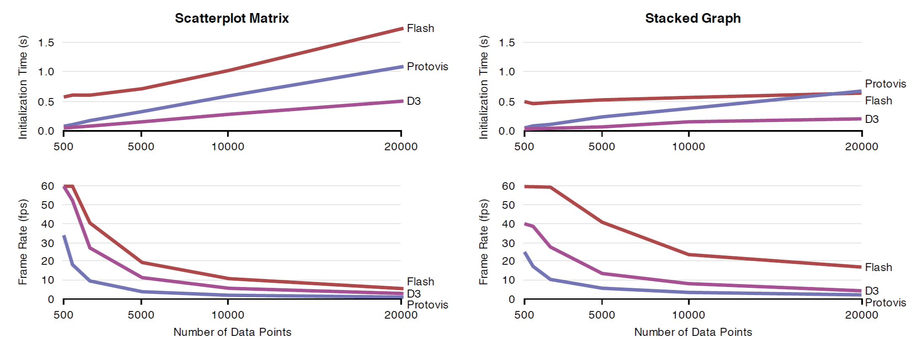
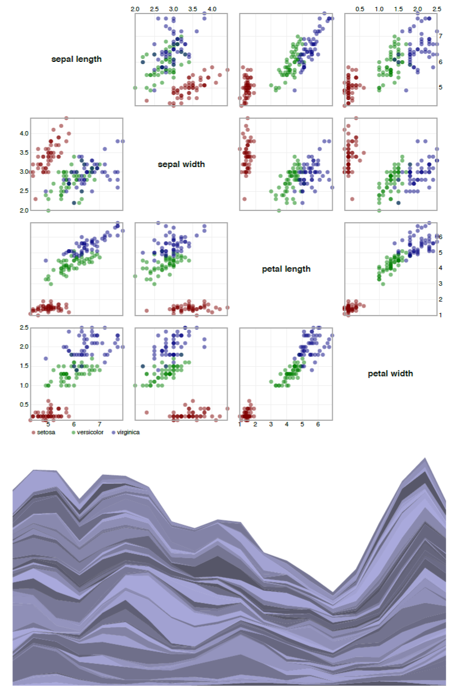

# D3：数据驱动文档（6）

## 6.性能基准

通过对原生表现层使用显式转换，D3 可以避免不必要的计算(转换可以限制在选择属性)和减少开销(直接修改DOM，消除间接过程)。相比如 Protovis等更高层次的框架，这些设计决策提高了性能而。我们现在通过对 D3 和 Protovis 构建的相同的可视化进行性能基准比较，证实这一说法。

此外，最近有许多炫耀关于现代浏览器（通常是在“HTML5”的外衣下）逐渐增强的图形和交互能力。 早前，设计者依赖如 Adobe Flash Player等专有的插件实现可交互的图形， ，本土现代web浏览器(通常是“HTML5”的外衣下)。以前,设计师依靠私有插件,即Adobe Flash Player,提供交互式图形。评估当前最先进的,我们在基准包括基于flash的可视化。为了评出当前最先进的方法，我们在基准里面也包含了基于 Flash 的可视化。

### 6.1 方法

我们用两个可视化图比较了 D3、Protovis 以及 Flash 的初始化时间和帧率，这两个图分别是支持交互和在四维空间连接[1]的散点矩阵图，以及动画堆叠图[37]。因此，我们比较了总共6个不同的可视化设计。图11展示了这两种可视化类型。两种基准指标对于基于 web 的可视化而言都很重要，长的页面加载时间被证实会增加用户流失[22]，而足够的帧率对于流畅的交互和动画是必须的。

我们模拟了与散点矩阵图的交互。在每一帧，我们随机选择一个组成图和里面的两个坐标，这些坐标定义刷新和连接的一个矩形区域。作为响应，每个散点图会对包含在选择区域的点进行强调。D3 和 Protovis 使用 SVG 的 circle 元素渲染点。在 Flash 中，我们使用它底层的 Flash 精灵对象表示点。通过将多个点渲染在 Flash 的同一个精灵中可能可以提高 Flash 的渲染性能。然而，这使得单个点的鼠标事件处理变得复杂了，因为我们不得不手动实现点击测试。SVG 为所有形状元素都提供了事件回调。为了提供一个公平的比较，我们保持跨平台的类似功能。

对于堆叠图，我们利用两组固定的数据连续切换来触发动画。D3 和 Protovis 的实现使用了与每个框架绑定的堆叠图布局方法。

我们为每个可视化测量了初始化时间（时间从页面加载到可视化的初始显示）和平均帧速率。初始化过程被重复了十次，然后取平均值。可视化随着模拟的交互或完成的动画循环运行，我们记录下5分钟内间隔10秒的平均帧速率。然后，我们计算出帧率样本的均值和方差。随着数据点的增多，从500增长到2,000，我们一直重复这个分析。在所有情况下，标准偏差小于1 - 2个数量级，所以目前我们都忽略了。

我们的测试环境如下，配置为 2.66 GHz的双核处理器，8 GB 的 RAM以及运行在 MacOS 10.6.7 系统上 的MacBook Pro，11.0 beta 版本的 Google Chrome  浏览器，拥有 版本号为 10.2  的 Adobe Flash Player 插件。 

### 6.2 结果和讨论

**图10. 性能测试。散点矩阵（左）和堆叠图（右）的初始化时间（上）和帧率（下）。**

**图11. 测试中使用的可视化图。(a) 带刷新和链接功能的散点矩阵。(b) 堆叠图。**

图10展示了我们的基准测试结果。对所有的可视化而言，浏览器本地工具从页面加载到渲染出可视化视图的初始化时间通常更快。D3 显著加快了页面的加载时间，比 Protovis 快两倍，比 Flash 快三倍。初始化 Flash 插件带来的消耗可能会导致这种差异，所以我们的结果考虑了对已经加载过的 Flash 库的缓存。我们还要注意到 Flash 可视化没有利用应用程序框架，如Adobe Flex，这导致增加了超过一秒的加载时间。

对于堆叠图，我们利用两组固定的数据连续切换来触发动画。D3 和 Protovis 的实现使用了与每个框架绑定的堆叠图布局方法。Protovis 实例使用了在版本 3.3 中支持的动画过渡。在 Flash 中，我们使用了 Flare 工具[9]支持的堆叠图布局和动画。

在帧率方面，Flash 提供了最佳的性能。随着数据点的数量增加，基于 Flash 的可视化每秒展示的帧是 D3 的 2-2.5倍。同时，D3 在浏览器本地工具中显示出较强的可伸缩性，随着数据集大小的增加，D3 至少表现出 Protovis 的双倍帧速率。这与先前利用 Protovis 实现贝塞尔曲线教程（见§5.3）的 Davies 报道的“从30到约90”的帧性能收益是匹配的。D3 的其它表现也被观察到时“更快的”。

此外，我们与 Protovis 的比较是保守的，因为在我们的基准测试中，大多数场景在每一帧都必须重绘。这对性能提供了一个有用的约束，但掩盖了常见的局部更新的例子。通过限制视图更新的部分，D3 转换比 Protovis 提供了更大的可伸缩性。D3 也允许更多的对文档结构的控制，允许进一步优化。例如，SVG 元素的使用可以有效的复制图形，而 CSS3 提供了某些动画转换的硬件加速。

我们的研究结果证实，D3 使用显式的转换和原生视图层，提供了更强的性能，D3 的页面加载时间和帧速率超过 Protovis 至少两倍，D3 可视化加载的的速度至少比基于 Flash 的可视化快三倍。然而，我们的研究结果也表明，浏览器厂商在改善 SVG 渲染性能上仍需努力。随着数据点的数量增加，Flash 保持了一贯的高帧速率。
