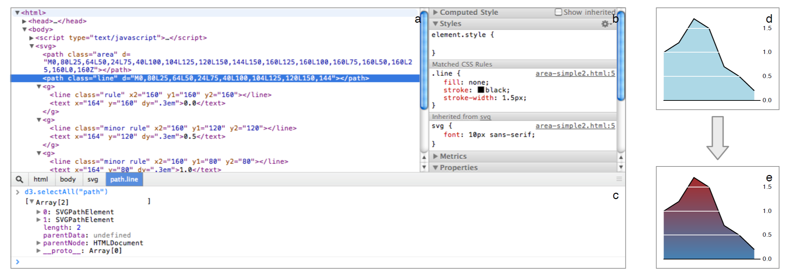

# D3：数据驱动文档（7）

## 7 反馈和观察

我们（和用户）使用 D3 解决了不同的可视化任务，这些任务对于 Protovis 而言可能很困难甚至是不可能实现。示例包括了纯 HTML 的显示(§5.1)，多级动画[15]以及复杂结构的交互可视化，包括拥有展开命令及围绕叶子节点的凸包的力导引图（见图1）。可以实现的转换也很明显。最近的一个设计师选择使用 D3 参加可视化比赛，强调了动态图形的情绪感染力，“这些转变是惊人的！使用它们给了我如此巨大的影响和灵感。”
 
虽然我们可以量化性能，但可访问性很难衡量。对 D3 的真正测试在于在用户中的使用，最初的反馈是积极的。Protovis专家写道，“其实是很容易转换，可能比 Protovis 还要简单。它很直接。“然而，有一个用户发现它的学习曲线”比Protovis陡”，而另一个写道，“我花了一段时间才领悟到其接口和一般哲学，但这一过程给了我宝贵的关于我们的数据的意义和性质的见解。部分问题可能是 SVG 规范的复杂性，这个阶段的关键似乎是去研究 SVG 规范，并检查 D3 生成的SVG 。经过一系列的迭代后一切开始变得有意义。“用户因此也很欣赏其对开发者工具的兼容。

**图4. Google Chrome 开发者工具。上面的区域可以查看(a) 文档层级 (b) 继承的样式属性；下面 (c) 控制台可以输入 JavaScript 执行。(d) 当前的文档：一个区域图。(e) 通过控制台改变后的区域图。**

我们还发现，事后可以通过控制台操作可视化是 D3 的一个独特和令人信服的优势。使用“粘性”数据，我们可以选择元素，运用新的运算符可以改变其外观或者行为。 这有助于快速迭代，例如，我们调整了一个用户表的颜色以提高对比（图4），然后又添加了事件监听器，以协调视图。在任何可视化中结合查看源代码的能力，我们对 D3 在合作潜力上有很高的期望。

通过构建关键标准，D3 保持跟上网络技术生态系统的演进，提高表达能力和可访问性。我们相信 D3 具备立即让设计师利用其新添加的浏览器特性的能力。我们还需要扩展 D3 的专业模块，D3 的核心语言提供了一个高效的指定丰富、动态可视化基础。
